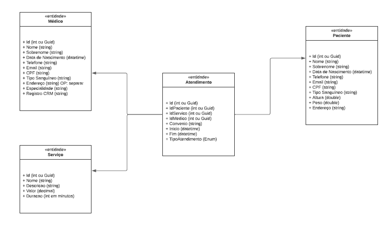

# Projeto 5 - Gerenciador de Clínicas

Repositório para o código do desafio da Mentoria Next WaveEducation

Sistema Gerenciador de Clínicas

Tecnologias utilizadas: 
- C#
- Autorização e Autententicação dom JWT
- MS SQL Server
- Arquitetura Limpa
- Minimal Apis
- Blob Storage
- Integração com Google Calendar
- Integração com Twilio
- Integração com RabbitMQ
- Caching Redis e Memory

Funcionalidades:
- Permite cadastro, atualização, remoção e adição de anexos para pacientes
- Permite cadastro, atualização, remoção e adição de anexos para médicos dos tipos: receita, pedido médico e evolução
- Permote cadastro, atualização e remoção de consultas médicas
- Permite cadastro, atualização e remoção de usuários

